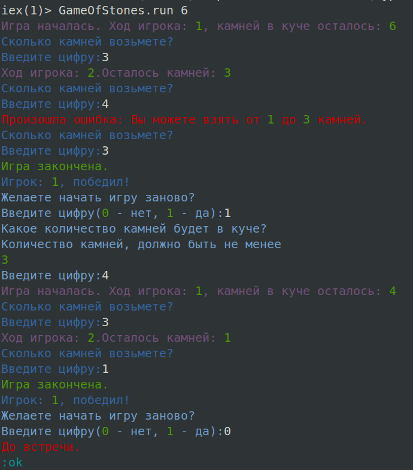

# Игра в кучу камней

## Правила
В куче лежит какое-то кол-во камней. Игроки по очереди берут кумешки из кучи. За один ход можно взять один, два или три камня.

## Особенности
Программа написана на [**Elixir**](https://elixir-lang.org/), на базе фреймврока [**GenServer/OTP**](https://elixir-lang.org/getting-started/mix-otp/genserver.html). Проект учебный, написал для лучшего понимания данной технологии :blush:

## Запуск
```
escript game_of_stones --stones 15
```
где цифра 15 кол-во камней в куче

## Визуализация
